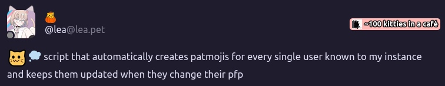

# Give Pats Fedibot

Bot for Mastodon(-compatible) and Misskey(-compatible) federated social media, which pats tagged users =3

Inspired by

<a href="https://lea.pet/notes/aa7tx71nvd"></a>
<small>clickable btw</small>

## (Planned) Features
- [x] Create and send GIF, where tagged user's profile picture gets patted
- [x] Create, add to an instance and send custom emoji, where tagged user's profile picture gets patted (Misskey-only)
- [ ] Automatically create pat emojis for every user on the same instance where this bot is hosted (Misskey-only)
- [ ] Automatically update pat emojis when user's profile picture updates (Misskey-only)

## How to use

1. Install [Bun](https://bun.sh/)
2. [Download the latest release](https://codeberg.org/linkinwires/GivePatsFedibot/releases) for the stable version or clone the repo for the latest version
3. `cd` into the cloned repo
4. Define env vars `INSTANCE_URL`, `ACCESS_TOKEN`, `SOFTWARE` and `BOT_USERNAME` if you are using Mastodon
    
    `INSTANCE_URL` holds URL of the instance the bot will operate on *with* `http(s)://` in the beginning and *without* the trailing slash.

    `ACCESS_TOKEN` holds API token given by your instance when you have created the app.

    `SOFTWARE` defined which driver to use, supports `misskey` and `mastodon`.

    `BOT_USERNAME` is the username of the account *without* the `@` in the beginning on behalf of which the bot will operate. This is required only if you use Mastodon (`SOFTWARE=mastodon`) since Mastodon's API does not allow you to get the account the bot operates on for some reason.

    If you are using Misskey, you can also define `MISSKEY_MODE`, which allows bot to generate either GIFs (`gif`) or custom emojis (`emoji`). If not set, the bot will default to generating GIFs.

    Examples of `.env` file:
    ```properties
    INSTANCE_URL=https://twink.men
    ACCESS_TOKEN=somerandomaccesstokendidyouthinkthatiwouldgiveyouaccesstokenyoucheekyperson
    SOFTWARE=misskey
    MISSKEY_MODE=gif
    ```
    ```properties
    INSTANCE_URL=https://soc.ua-fediland.de
    ACCESS_TOKEN=hahahahadidyoureallythoughtthatiwouldgiveyouaccesstokenthistimehaventyoulearnedyourlesson
    SOFTWARE=mastodon
    BOT_USERNAME=givepats
    ```
5. Run `bun run src/index.ts`

### Beyond basics
If you want to run the bot as a systemd daemon, consult [the official Bun guide](https://bun.sh/guides/ecosystem/systemd)